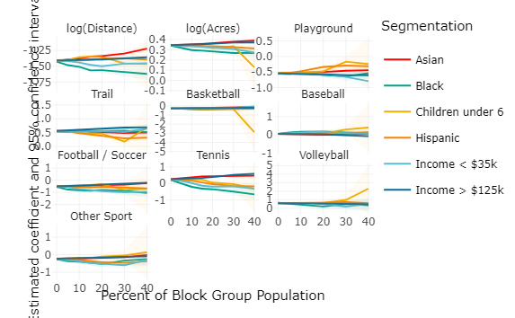

# Results {#results}

```{r estimation-setup, message=FALSE, warning=FALSE, cache = FALSE, echo=FALSE}
library(tidyverse)
library(mlogit)
library(modelsummary)
library(broom)
library(kableExtra)
library(sf)
library(ggmap)
library(leaflet)
knitr::opts_chunk$set(cache = TRUE)

inline_hook <- function(x) {
  if (is.numeric(x)) {
    format(x, digits = 3, big.mark = ",")
  } else x
}
knitr::knit_hooks$set(inline = inline_hook)
# overloaded methods for doing prediction with mlogit objects
source("R/methods.R")

# function to index a tibble for mnl estimation
logit_converter <- function(df) {
  dfidx(df, idx = list("id", "alt"), shape = "long",  
      choice = "chosen", idnames = "id", drop.index = FALSE)
}

# function to estimate the mnl model on a subset of data
group_mnl <- function(df){
  tryCatch({
    mlogit(chosen ~ yj_distance + yj_acres + playground + baseball +  basketball +
             `football / soccer` + other_pitch + volleyball + tennis + trail | -1,
           data = df)
  }, error = function(e){
    warning(e, "could not estimate mnl")
    return(NA)
  })
}

this_map = c(
    "yj_distance" = "log(Distance)",
    "yj_acres" = "log(Acres)",
    "playgroundTRUE" = "Playground",
    "trailTRUE" = "Trail",
    "pitchTRUE" = "Sport Field",
    "basketballTRUE" = "Basketball",
    "baseballTRUE" = "Baseball",
    "`football / soccer`TRUE" = "Football / Soccer",
    "tennisTRUE" = "Tennis",
    "volleyballTRUE" = "Volleyball",
    "other_pitchTRUE" = "Other Sport"
  )

this_crs <- 2227 # EPSG:2227 – NAD83 / California zone 3 (ftUS)
```


```{r load, echo=FALSE}
logitdata <- read_rds("data/logitdata.rds")
dfi <- logit_converter(logitdata)
valid <- filter(dfi, validation)
estim <- dfi
```

We estimated multinomial logit park activity location choice models on the datset described in the previous section. We applied a Yeo-Johnson transformation [@Yeo2000] to both distance the distance (in meters) between the park and the block group centroid, and to the park acreage. The Yeo-Johnson transformation replicates the constant marginal elasticity of a logarithmic transformation while avoiding undefined values (e.g., $YJ(0) = 0$). For simplicity, we call this transformation `log()` in the model results tables. Using a constant marginal elasticity is better reflective of how people perceive distances and sizes; a one-mile increase to a trip distance matters more to a two-mile trip than a ten-mile trip.

```{r base_models, echo=FALSE}
base_models <- list(
  "Network Distance"   = mlogit(
    chosen ~ yj_distance + yj_acres | -1 ,  data = estim),
  "Park Attributes"    = mlogit(
    chosen ~ yj_distance + yj_acres +  playground + trail + pitch | -1 , 
    data = estim),
  "Sport Detail"    = mlogit(
    chosen ~ yj_distance + yj_acres + playground + baseball +  basketball +
      `football / soccer` + other_pitch + volleyball + tennis + trail | -1 , 
    data = estim)
)
detail_lrt <- lrtest(base_models[[2]], base_models[[3]])$`Pr(>Chisq)`[2]
d_ratio_base <- -1 * coefficients(base_models$`Network Distance`)[1] / 
  coefficients(base_models$`Network Distance`)[2] 
d_ratio_sport <- -1 * coefficients(base_models$`Sport Detail`)[1] / 
  coefficients(base_models$`Sport Detail`)[2] 
```

Table \@ref(tab:base-modelsummary) presents the model estimation results for each estimated model. The "Network Distance" model, which only considers the distance to the park and the size of the park results in significant estimated coefficients of the expected sign: That is, individuals will travel further distances to reach larger parks. The ratio of the estimated coefficients implies that on average, people will travel `r d_ratio_base` times further to reach a park twice as large.

Table \@ref(tab:base-modelsummary) also shows the results of the "Park Attributes" model, which represents the presence of any sport field with a single dummy variable, and the "Sport Detail" model, which disaggregates this variable into facilities for different sports. The value of the size and distance coefficients change modestly from the "Network Distance" model, with the implied size to distance trade-off rising to `r d_ratio_sport`. Examining the two amenities models --- independently and in comparison with each other --- reveals a few surprising findings. First, it appears that playgrounds and sport fields in general contribute *negatively* to the choice utility equation. This is both unintuitive and contradictory to previous findings in this space [e.g.,  @Kinnell2006]. Considering different sports separately, there is a wide variety of observed response with tennis and volleyball facilities attracting more trips, and football and basketball facilities attracting fewer, all else equal. Trails and walking paths give substantive positive utility in both models. The difference in likelihood statistics between the three models is significant (likelihood ratio test between Sport Detail and Park Attributes model has $p$-value  `r detail_lrt`), and so in spite of the curious aggregate findings, we move forward with this utility specification.

```{r base-modelsummary, echo=FALSE}
modelsummary(
  base_models, stars = TRUE, output = "kableExtra",
  coef_map = this_map, gof_omit = "BIC",
  title = "Estimated Model Coefficients"
) %>%
  scroll_box(width = "100%", box_css = "border: 0px;")
```


```{r grouped_models, echo=FALSE}
minority_models <- estim %>%
  mutate(group = case_when( black > 30 ~ "black", asian > 30 ~ "asian", 
                            hispanic > 30 ~ "hispanic", TRUE ~ "othermin"
  )) %>%
  filter(!is.na(group)) %>%
  group_by(group) %>% nest() %>% ungroup() %>%
  mutate(
    data = map(data, logit_converter),
    mnl = map(data, group_mnl)
  ) 
income_models <- estim %>%
  mutate(group = case_when(lowincome > 30 ~ "lowincome", 
                           highincome > 50 ~ "highincome", TRUE ~ "otherinc")) %>%
  filter(!is.na(group)) %>%
  group_by(group) %>% nest() %>% ungroup() %>%
  mutate(
    data = map(data, logit_converter),
    mnl = map(data, group_mnl)
  )
child_models <- estim %>%
  mutate(group = case_when(children > 25 ~ "children", 
                           children < 5 ~ "few children", TRUE ~ "otherch")) %>%
  filter(!is.na(group)) %>%
  group_by(group) %>% nest() %>% ungroup() %>%
  mutate(
    data = map(data, logit_converter),
    mnl = map(data, group_mnl)
  )

grouped_models <- lapply(list(child_models, income_models, minority_models), 
                       function(df){
  lapply(df$mnl, function(x) x) %>% 
    set_names(nm = c(df$group)) 
}) %>%
  unlist(recursive = FALSE)
```

It is worth investigating the heterogeneity in preferences that exist among populations. Though the income and ethnicity of the synthetic park visitors is not known, we can segment the estimation dataset based on the socioeconomic makeup of the visitors' residence block group. The models presented in  Table \@ref(tab:grouped-modelsummary) were estimated on segments developed in this manner. Models under the "Race/Ethnicity" heading include a race- and ethnicity-based segmentation: simulated individuals living in block groups with more than thirty percent Black residents are included in the ">30% Black" model, an analogous segmentation for block groups with high Asian and Hispanic populations are in the ">30% Asian" and ">30% Hispanic" models respectively, and the "Other" model contains all other block groups. Another set of model segmentation relies on the share of the population in each block group with household incomes above or below certain thresholds, and a third relies on the share of households with children under 6 years old. Again, we use the threshold definitions largely informed by the distributions in \@ref(tab:acs-table).

```{r grouped-modelsummary}
grouped_models_clean <- list(
  "> 30% Asian" = grouped_models$asian,
  "> 30% Black" = grouped_models$black,
  "> 30% Hispanic" = grouped_models$hispanic,
  "Other" = grouped_models$othermin,
  "> 30% Low income" = grouped_models$lowincome,
  "> 50% High income" = grouped_models$highincome,
  "Other" = grouped_models$otherinc,
  "> 25% children" = grouped_models$children,
  "< 5% children" = grouped_models$`few children`,
  "Other" = grouped_models$otherch
)

#CTV: Commented out scroll_box() because I get an error I can't
# explain when it's in there ("attempt to select less than one 
# element in integerOneIndex"). The other way to get rid of that error
# is to get rid of the add_footnote() line - but that seems more 
# important to leave in than the the scroll box.

modelsummary(
  grouped_models_clean, stars = TRUE, output = "kableExtra",
  coef_map = this_map, gof_omit = "BIC", 
  title = "Estimated Model Coefficients with Block Group Segmentations"
) %>%
  add_header_above(c(" " = 1, "Race/Ethnicity" = 4, "Income" = 3, "Children" = 3)) %>%
#  scroll_box(width = "100%", box_css = "border: 0px;") %>%
  landscape() %>%
  kable_styling(latex_options = c("striped", "scale_down")) %>%
   add_footnote(
  "Simulated individuals segmented based on the share of households meeting the segmentation threshold in the residence block group.")

```

The model estimates in Table \@ref(tab:grouped-modelsummary) reveal noticeable heterogeneity in the park location choices among visitors from different block group segments. Park visitors living in block groups with a high proportion of Black and low-income residents show less affinity for trails and other walkways, but appear  considerably more sensitive to the distance to a park. Park visitors living in high-income neighborhoods are less sensitive to the distance to a park, but receive more utility from certain amenities, in particular trails and tennis courts. Block groups with a high proportion of Hispanic residents and residents with children under 6 show the least negative response to playgrounds of all the segments.

  
```{r split_models, cache.lazy = FALSE, eval=FALSE, echo=FALSE}
# write a function to estimate multiple MNL models on different 
# segments of the estimation data
estimate_split_models <- function(data, var, splits) {
  #print(var)
  lapply(splits, function(p){
    #print(p)
    data %>% 
      filter(.data[[var]] > p) %>% tibble() %>%
      mutate(share = p)
  }) %>%
    bind_rows() %>% group_by(share) %>% nest() %>%
    mutate(
      data = map(data, logit_converter),
      mnl = map(data, group_mnl),
      coef = map(mnl, tidy)
    )
}

splits <- c(0, 5, 10, 15, 20, 30, 40)
split_models <- lapply(c("black", "asian", "hispanic", "lowincome", "highincome", "children"), function(var) {
  estimate_split_models(estim, var, splits) %>%
    mutate(Segmentation = var)
}) %>% bind_rows() 
```

Seeing that there is a difference in the response in the model segmentation, it is also worth considering the role of our segmentation thresholds in these findings. Figure \@ref(fig:split-plots) shows the estimated coefficients and confidence intervals for these different amenities at different threshold levels of segmentation. The threshold level means that at least that percent of the block group's population falls in that category. The confidence intervals widen as more observations are excluded from the model. The estimated coefficients for the different segmentations are identical when the share equals zero, and simply represent the "Sport Detail" model from Table \@ref(tab:base-modelsummary).

Overall, increasing the segmentation threshold level reveals additional information about user preferences. First, it should be noted that there is some inconsistency: for instance, block groups with at least 40% of low income households show a lower importance of distance than block groups with either 30% low income households. The increasing width of the confidence interval, however, means it is sometimes difficult to make generalized statements. Residents of block groups with a higher share of Asian or high income households both show relatively more affinity for tennis courts and trails relative to other groups. Residents of block groups with increasing shares of Hispanic individuals show the highest affinity for playgrounds, and park goers from neighborhoods with a greater share of Black individuals are most sensitive to distance and least sensitive to park size.

```{r split-plots-knit, fig.cap="Estimated utility coefficients and 95% confidence intervals for park amenities at different socioeconomic threshold levels.", fig.height=7.5, echo=FALSE}



```

```{r split-plots-orig, fig.cap="Estimated utility coefficients and 95% confidence intervals for park amenities at different socioeconomic threshold levels.", fig.height=7.5, cache = FALSE, eval=FALSE, echo=FALSE}
# extract the coefficients you need to plot
dat <- modelplot(split_models$mnl %>% 
            setNames(str_c(split_models$Segmentation, split_models$share, sep = "_")),
          coef_map = this_map, draw = FALSE) %>%
  separate(model, into = c("Segmentation", "share"), convert = TRUE, sep = "_") %>%
  mutate(
    Segmentation = case_when(
      Segmentation == "black" ~ "Black",
      Segmentation == "asian" ~ "Asian",
      Segmentation == "hispanic" ~ "Hispanic",
      Segmentation == "lowincome" ~ "Income < $35k",
      Segmentation == "highincome" ~ "Income > $125k",
      Segmentation == "children" ~ "Children under 6"
    )
  )

# make the plot
these_colors <- c(wesanderson::wes_palettes$Darjeeling1, "#046C9A")
split_plots <- ggplot(dat, aes(x = share, y = estimate, 
                               ymin = conf.low, ymax = conf.high, 
                color = Segmentation, fill = Segmentation)) + 
  theme_minimal() +
  geom_line() + 
  geom_ribbon(alpha = 0.05, size = 0.1, lty = "dotted") + 
  facet_wrap(~ fct_rev(term), scales = "free_y", ncol = 3)  + 
  scale_color_manual(values = these_colors) + 
  scale_fill_manual(values = these_colors) + 
  xlab("Percent of Block Group Population") + 
  ylab("Estimated coefficient and 95% confidence interval")

if(knitr::is_latex_output()) {
  lemon::reposition_legend(split_plots, position = 'top left', panel = "panel-3-4")
} else {
  plotly::ggplotly(split_plots)
}
```

## Equity Analysis of COVID-19 Street Openings

In this section, we apply the models estimated above to evaluate the benefits of the street conversion policy in terms of aggregate value determined by the change in accessibility logsum, as well as the equity of the policy with respect to different income and ethnic groups.

```{r street_distances}
# distances computed in py/shortest_paths.py
shortest_path_dir <- "data/shortest_paths_street"
if(!dir.exists(shortest_path_dir)) {
  system2("7z", args = c("x", "data/shortest_paths_street.7z", "-odata/"))
}
path_files <- dir("data/shortest_paths_street/", full.names = TRUE)
street_distances <- lapply(path_files, function(file) {
  read_csv(file, col_types = list(geoid = col_character(), park_id = col_character())) %>%
  mutate(
    yj_distance = VGAM::yeo.johnson(distance, lambda = 0),
    yj_euc_dist = VGAM::yeo.johnson(euc_dist, lambda = 0)
  )
}) %>%
  bind_rows() %>%
  rename(home = geoid, park = park_id) %>%
  mutate(home = str_pad(home, width = 12, side = "left", pad = "0"))
```


```{r choices}
# read data on streets and distances
distance_df <- read_rds("data/distances.rds")
street_parks <- read_rds("data/street_parks.rds")
attributed_parks <- read_rds("data/attributed_parks.rds") %>%
  mutate(chosen = FALSE) %>% ungroup()
attributed_parks$chosen[55] <- TRUE

# create base situation prediction dataset
base_choices <- distance_df %>%
  left_join(attributed_parks, by = c("park" = "id")) %>% 
  rename(id = home, alt = park) %>%
  logit_converter()

# create streets situation prediction dataset, augmented by street parks
street_choices <-  left_join(
  bind_rows(street_distances, distance_df),
  bind_rows(street_parks %>% mutate(chosen = FALSE, attractions = FALSE), 
            attributed_parks),
  by = c("park" = "id")) %>%
  rename(id = home, alt = park) %>%
  logit_converter()
```


```{r logsums_knit, echo=FALSE}
blockgroups <- read_rds("data/blockgroups_logsum.rds")
```

```{r logsums_orig, eval=FALSE}
logsums <- lapply(list("Base" = base_choices, "Streets" = street_choices), function(df){
  u <- predict(base_models$`Sport Detail`, newdata = df, type = "linpred")
  logsum <- log(rowSums(exp(u)))
  list( u = u, logsum = logsum )
})

logsums_tibble <- tibble(
  geoid = names(logsums$Base$logsum),
  base = logsums$Base$logsum,
  streets = logsums$Streets$logsum
)

blockgroups <- read_rds("data/blockgroups.rds") %>%
  left_join(logsums_tibble, by = "geoid") %>%
  mutate(diff_ls = (streets - base) / 0.215)
```

Figure \@ref(fig:logsumsmap) presents this monetary valuation spatially. Unsurprisingly, the benefits are concentrated in the block groups surrounding the opened streets. Most residents of central Oakland see a benefit of somewhere around \$1, while some zones see an equivalent benefit of as much as \$30. One property of logsum-based accessibility terms is that there is some benefit given for simply having more options, whether or not those options are attractive in any way. In this application, these benefits are small, on the order of 10 cents for most block groups away from where the street openings occurred.

```{r logsumsmap, fig.cap="Monetary value of street opening to residents based on utility change. Streets converted to pedestrian plazas are shown in black.", cache=FALSE}
bins <- c(0, 0.1, 0.25, 0.5, 1, 2, 10, 35)
mypal <- as.character(wesanderson::wes_palette("Zissou1", n = 7, type = "continuous"))

if(knitr::is_latex_output()) {
  alameda_back <- get_map(c(lon = -122.1300334, lat = 37.69427), 
                                zoom = 11, source = "stamen", color = "bw")
  alameda_back <- ggmap_bbox(alameda_back)
  
  ggmap(alameda_back, extent = "device") + 
    coord_sf(crs = st_crs(3857), 
             xlim = c(-122.29674 , -122.16358), 
             ylim = c( 37.74098, 37.87028), expand = FALSE) + 
    geom_sf(data = blockgroups %>% st_transform(3857), inherit.aes = FALSE,
            aes(fill = cut(diff_ls, breaks = bins)), lwd = 0) + 
    scale_fill_manual("Monetary Benefit ($)", values = mypal) +
    geom_sf(data = slowstreets, color = "black", inherit.aes = FALSE) + 
    theme(axis.line = element_line(color = NA))  + 
    xlab("") + ylab("")
    
} else {
  diff_pal <- colorBin(palette = mypal, domain = blockgroups$diff_ls, bins = bins )
  
  leaflet(data = blockgroups %>% st_transform(4326)) %>%
    addProviderTiles(providers$Esri.WorldGrayCanvas) %>%
    addPolygons(fillColor = ~diff_pal(diff_ls), 
                stroke = FALSE, fillOpacity = 1) %>%
    addPolylines(data = slowstreets %>% st_transform(4326), color = "grey") %>%
    addLegend("bottomleft", pal = diff_pal, values = ~diff_ls, title = "Value of Street Opening")
}
```

More interesting than the total benefit or even its spatial distribution, however, is the social equity of its distribution among different population segments. If we assign the block-group level monetary benefit to each household in the block group, we can begin to allocate the distribution of benefits proportionally to households of different sociodemographic classifications. Specifically, if a block group with $N$ total households has a measured consumer surplus $\delta CS$, then the share of the total benefits going to a particular population segment $k$ is

\begin{equation}
  S_k = N * P_k * \delta CS
  (\#eq:cs-alloc)
\end{equation}

where $P_k$ is the proportion of the block group's population in segment $k$. There is some opportunity for confusion when some demographic variables we use (share of households with children, household income) are defined at the household level and other (ethnicity) are defined at the person level. It is similarly not clear whether the benefits of improved park access should be assigned at the person level, the household level, or the number of total park trip makers in each block group. For consistency and simplicity, we assert that the benefit is assigned to each household, and that persons receive a proportional share of the household benefit. For example, a block group with 30% Black individuals will receive 30% of the benefits assigned to all the households in the block group. 

Table \@ref(tab:equity) shows the total benefit assigned to households in this way as well as the share of all monetary benefits in the region. In some cases, the policy of opening streets as public spaces had a pro-social benefit, as 18.7\% of benefits went to Black individuals, even though only 11.4\% of the population of Alameda County is Black. Similarly, roughly one-quarter of total benefits went to households making less than \$35,000 per year even though only one-fifth of the households are in this category. On the other hand, a smaller than expected share of benefits is allocated to Asian individuals and households making more than $125,000 per year. 

```{r equity, echo=FALSE}
# percent of households / individuals in each group
demovars <- c("children", "lowincome", "highincome", "black", 
              "asian", "hispanic", "white", "all")
demonames <- c("Households with Children under 6", "Income < $35k",
               "Income > $125k", "Black", "Asian", "Hispanic", "White", 
               "All Households")

# Raw demographic totals
pop_dist <- blockgroups %>% st_set_geometry(NULL) %>% as_tibble()  %>%
  mutate(all = 100) %>%
  mutate_at( demovars, (~ ./100 * households)) %>%
  select(all_of(demovars)) %>%
  summarise_all(~sum(., na.rm = TRUE)) %>%
  gather("group", "population") %>%
  mutate(
    `pct_pop` = population / population[length(demonames)] * 100 
  )

bene_dist <- blockgroups %>% st_set_geometry(NULL) %>% as_tibble()  %>%
  # benefit is the choice benefit * households * proportion of category 
  mutate(all = 100) %>%
  mutate_at( demovars, (~ ./100 * households * diff_ls)) %>%
  select(all_of(demovars)) %>%
  summarise_all(~sum(., na.rm = TRUE)) %>%
  gather("group", "benefit")    %>% 
  mutate(
    pct_benefit = benefit / benefit[length(demonames)] * 100 
  ) 

left_join( bene_dist, pop_dist, by = "group" ) %>%
  mutate(
    group = demonames,
    group = fct_relevel(group, "All Households", after = 1),
    benefit = scales::dollar(benefit),
    population = scales::comma(population)
  ) %>%
  kbl(caption = "Equity Distribution of Street Opening Benefits", booktabs = TRUE, 
      col.names = c("Group", "Benefit", "Percent* of Benefits", "Households**", 
                    "Percent of Households"),
      digits = c(0, 0, 2, 0, 2),
      align = c('l', rep('c', 4))) %>%
  kable_styling(latex_options = c("scale_down")) %>%
  column_spec(1, width = "1.8in") %>%
  column_spec(2:5, width = "1in") %>%
  footnote(symbol = c(
    "As individuals and households will belong in multiple groups, the percents do not sum to 100.",
    "Race and ethnicity are person-level attributes; households are assumed to follow the same distribution."))
```


